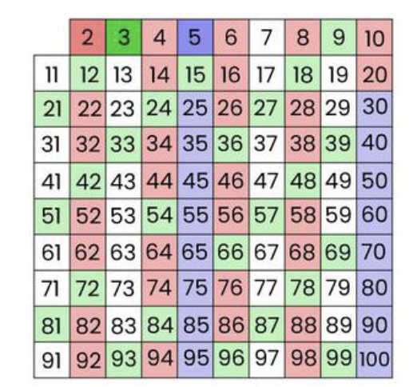
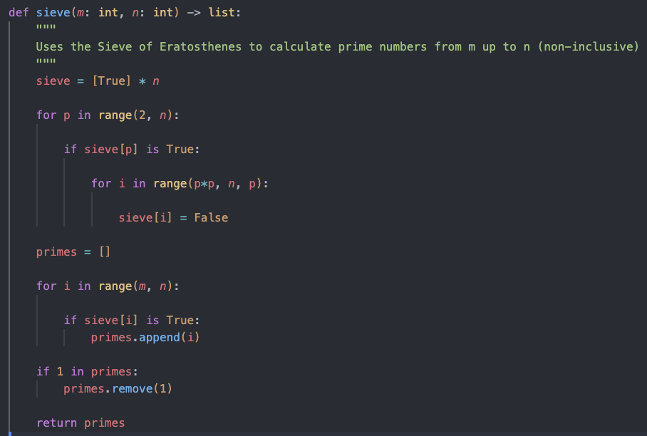

# Project-Euler

#### Here is a run through of a repeated code segment used to generate a bounded list of primes

### Pseudocode

#### - Set all primes initially to True (prime)

#### - Find first number currently True (start with 2) and set all its multiples to False

#### - Repeat until either all numbers checked

#### - Return values finished with True

### Code

